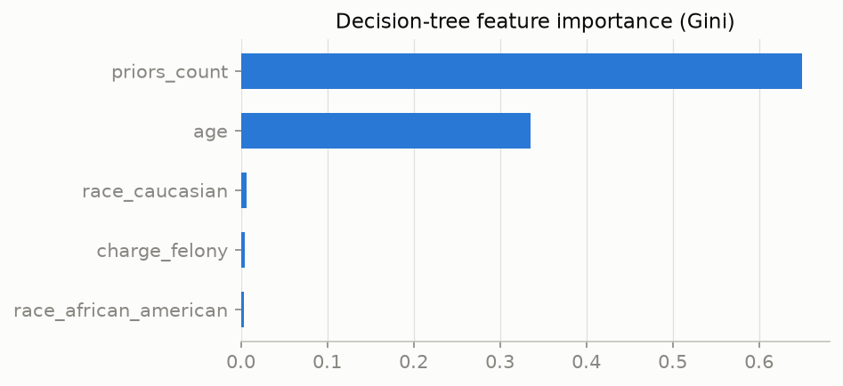
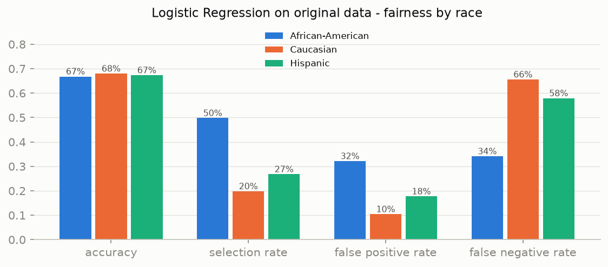
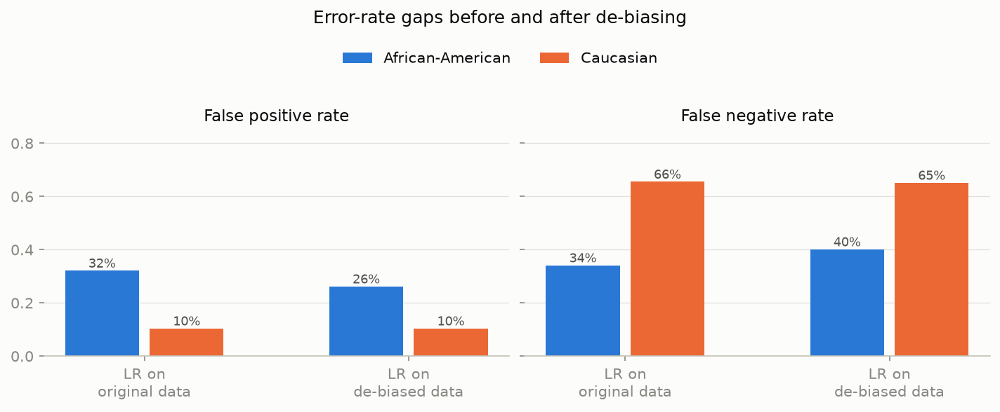
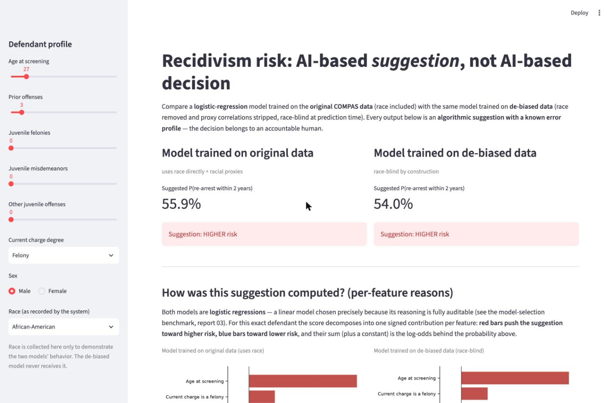

# COMPAS Bias Analysis — Final Report

**From AI-based decision to AI-based suggestion**

## Abstract

The COMPAS dataset (ProPublica, Broward County, Florida, 2013–2014) is a record
of **criminal-justice decisions**, not of crime: who was arrested, charged,
scored, and re-arrested by one county's justice system over two years. This
project identifies the bias embedded in that record, mitigates it with
transparent data-level methods, and reframes the resulting model as an
**AI-based suggestion to an accountable human decision-maker** rather than an
AI-based decision. The work is organized around three ALTAI requirements:
**#1 Human Agency and Oversight** (the suggestion framing, the demo's required
human decision with rationale), **#2 Technical Robustness and Safety**
(accuracy and per-group error audits), and **#5 Diversity, Non-discrimination
and Fairness** (automated bias detection and mitigation).

## Key results

| | Biased LR (original data) | De-biased LR (race-blind) |
|---|---:|---:|
| Accuracy | 67.2% | 67.1% |
| ROC-AUC | 0.724 | 0.724 |
| Demographic parity difference | 0.300 | **0.238** |
| Equalized odds difference | 0.315 | **0.250** |
| Race share of SHAP attribution | 6.1% | **0** (not an input) |
| Suggestions changed by a race flip | 6.7% (AA→Cauc.) | **exactly 0, by construction** |

A model-selection benchmark (report 03) shows every classifier family lands
within ~0.02 ROC-AUC on this data, so the project uses a **logistic
regression** — tied-best on accuracy and fully interpretable, with no accuracy
argument for an opaque model. De-biasing costs 0.1 percentage points of
accuracy — essentially noise — while cutting the group-fairness gaps by about a
fifth and eliminating individual race sensitivity entirely. The residual gap is
driven by base-rate differences in the re-arrest label, which no feature-level
intervention can remove; this is the strongest argument for keeping a human in
the loop.

---

## 1. Dataset and research questions

Source: `compas-scores-two-years.csv` from ProPublica's
[compas-analysis](https://github.com/propublica/compas-analysis) repository.
Raw file: 7,214 defendants, 53 variables; after ProPublica's cohort filter
(screening within ±30 days of arrest, valid COMPAS record, no ordinary traffic
offenses, non-missing score): **6,172 defendants**. Full analysis in
[reports/02_eda.md](reports/02_eda.md).

### RQ1 — Is the dataset representative, and what does it represent?

Every row is a criminal defendant screened with the COMPAS tool in Broward
County, FL, 2013–2014, joined with criminal history and a two-year re-arrest
flag (`two_year_recid`). The outcome label is **re-arrest, not re-offense**:
crimes that never lead to an arrest are invisible, and arrest intensity varies
across neighborhoods and demographic groups. The data covers one county, one
two-year window, and only people who were arrested and screened — it is not
representative of crime, of the US, or even of Broward County's general
population (African-Americans were roughly 28% of the county's population but
are 51% of the defendants). It is the canonical AI-fairness benchmark because
it combines a deployed algorithm's actual scores, ground-truth follow-up, and
sensitive attributes.

### RQ2 — Does the dataset reflect historical and institutional inequalities?

Yes, by construction. Each row is the product of discretionary human decisions
with documented disparities: policing bias (who gets stopped and arrested —
the same mechanism that generates the label), charging and sentencing bias
(`c_charge_degree` and `priors_count` reflect prosecutorial and judicial
choices), socioeconomic inequality (priors accumulate faster where people
cannot afford bail or counsel), and feedback loops (a high score leads to
detention and surveillance, raising the probability of future *arrest*). A
model trained on this data learns the behavior of the Broward County justice
system as much as the behavior of defendants.

### RQ3 — What demographic disparities exist in the dataset?


African-American 51.4%, Caucasian 34.1%, Hispanic 8.2%; 81% male; median age 31.


Caucasian decile scores pile up at the low end (mean 3.6) while
African-American scores are close to uniform (mean 5.3); 58% of
African-American defendants are rated Medium/High risk versus 33% of Caucasian
defendants. Observed two-year re-arrest rates differ too (52% vs 39%) — but
the label itself is generated by the same unequally distributed enforcement.


The core ProPublica finding, reproduced: treating Medium/High as a positive
prediction, African-American defendants who did **not** recidivate were flagged
risky at a **42.3%** false positive rate versus **22.0%** for Caucasian
defendants (about 1.9×), while Caucasian defendants who **did** recidivate were
mislabelled low-risk at 49.6% versus 28.5% (about 1.7×). The errors are
asymmetric in direction: excess detention for Black defendants, excess leniency
for white defendants.

## 2. Baseline models and fairness audit

Split: 70/30 train/test, stratified jointly on outcome and race (4,320 train /
1,852 test), persisted to disk so every later script scores the identical test
set. Features: age, priors count, juvenile counts, charge degree, sex, **and
race** (one-hot) — race is kept in the baseline deliberately, to expose how
much predictive weight the data assigns to it (see "Decisions made"). Full
detail in [reports/04_baseline.md](reports/04_baseline.md).

### Model selection

Before fixing an architecture, every practical classifier family (logistic
regression, SVM, decision tree, random forest, gradient boosting, MLP, k-NN,
naive Bayes) was benchmarked under the race-blind deployment regime with 5-fold
cross-validation. Every genuine model lands in a CV ROC-AUC band of just
0.704–0.735 and ~66–67% accuracy — a quantitative confirmation of Dressel &
Farid (2018) that model complexity buys essentially nothing here, and that no
family is meaningfully "fairer" than another (unfairness lives in the labels,
not the estimator). Because performance is tied, the project selects **logistic
regression**: tied-best on accuracy, fully interpretable (one signed weight per
feature), well-calibrated, and a linear match to the linear de-biasing step.
Full benchmark in [reports/03_model_selection.md](reports/03_model_selection.md).

### Interpretable decision tree

Accuracy 66.3%, ROC-AUC 0.709.




Two findings matter for the ethics assessment. First, the transparent
five-feature tree matches COMPAS's own ~65% accuracy (echoing Dressel & Farid
2018) — there is no accuracy argument for opacity. Second, race dummies barely
appear in the split rules, yet the fairness audit still shows large error-rate
gaps: the bias travels through `priors_count` and `age`, which are themselves
products of unequal policing intensity (RQ2).

### Reference logistic regression ("biased model")

Logistic regression, accuracy 67.2%, ROC-AUC 0.724. Because the model is linear
its logic is fully readable: the standardized coefficients are dominated by
`priors_count` (+0.76) and `age` (−0.50).



| Metric | African-American | Caucasian | Hispanic |
|--------|----------------:|----------:|---------:|
| Accuracy | 66.8% | 68.0% | 67.3% |
| Selection rate | 49.8% | 19.8% | 26.8% |
| False positive rate | 32.2% | 10.4% | 17.7% |
| False negative rate | 34.1% | 65.6% | 57.9% |

Aggregate disparity (African-American vs Caucasian): **demographic parity
difference 0.300**, **equalized odds difference 0.315**. Training a fresh model
on the raw data reproduces the injustice pattern of the data-generating system;
this is the reference point the de-biasing must improve on. Under ALTAI
Requirement #2, ~67% accuracy means roughly one suggestion in three is wrong —
tolerable, if at all, only in a decision-support setting.

## 3. Automated bias detection and de-biasing

Full detail in [reports/05_debias.md](reports/05_debias.md).

**Detection 1 — correlation scan.** Pearson correlation of each feature with
the African-American indicator on the training split: `priors_count` +0.203,
`age` −0.189, `charge_felony` +0.107, plus smaller correlations for the
juvenile counts and sex. The features the baseline models lean on are exactly
the ones that carry race information — the quantitative footprint of the
institutional bias in RQ2.

**Detection 2 — proxy test.** A logistic regression predicting whether a
defendant is African-American from the seven non-race features reaches
**AUC 0.682** on the held-out split — far from random. Simply deleting the
race column does not remove race from the data ("fairness through
unawareness" fails).

**Mitigation.** (1) Race dummies removed from the feature set — a protected
attribute must not be a direct input to a punitive risk model (ALTAI #5).
(2) Fairlearn **`CorrelationRemover` (alpha=1.0)** applied to the remaining
features, linearly transforming each so its correlation with the
African-American indicator becomes zero while retaining as much information as
possible. After the transformation, the proxy test drops to **AUC 0.508**
(~random) and every feature–race correlation is ~0.


**What this does not fix:** label bias (the re-arrest target embeds unequal
enforcement; base rates of 52% vs 39% cannot be repaired by any feature
transformation), non-linear proxies (CorrelationRemover is linear, though the
near-random proxy AUC suggests little non-linear signal remains here), and the
Chouldechova (2017) impossibility theorem — with different base rates,
calibration and equal error rates cannot both hold.

**Note on the dropped AutoML step.** The original proposal included an AutoML
tool to pinpoint what needs de-biasing. That step was descoped and replaced by
the automated detection above (correlation scan + proxy predictability test +
the Fairlearn audit of section 2), which fulfils the same role with
transparent, reproducible methods.

## 4. De-biased logistic regression and the deployment decision

Identical architecture to the reference model (StandardScaler + logistic
regression), trained on the de-biased features. Race enters the pipeline only as
an audit attribute. Full detail in
[reports/06_debiased_model.md](reports/06_debiased_model.md).

### Race-blind vs race-aware inference

The CorrelationRemover needs the sensitive attribute to transform a row, which
forces a choice at prediction time:

| Deployment | Accuracy | Demographic parity diff. | Equalized odds diff. | Individual race-invariance |
|------------|---------:|-------------------------:|---------------------:|:--:|
| **Race-blind** (raw features at inference — chosen) | 67.1% | 0.238 | 0.250 | yes — exact |
| Race-aware (transform with the person's race) | 65.0% | 0.028 | 0.075 | no |

The race-aware variant achieves markedly better group fairness — pairing the
linear CorrelationRemover with a linear model drives the demographic-parity
difference down to near-parity (0.028) — but a person's stated race then moves
their individual score: it breaks counterfactual fairness, requires collecting
the protected attribute at decision time, and amounts to explicit differential
treatment. We deploy **race-blind**: the de-biasing is a training-time
intervention, and at prediction time the model never sees race, so flipping race
provably cannot change any suggestion.

### Results



| Metric | LR original | LR de-biased |
|--------|-------------:|--------------:|
| Accuracy | 67.2% | 67.1% |
| FPR gap (AA − Cauc.) | 21.7% | **15.8%** |
| FNR gap (Cauc. − AA) | 31.5% | **25.0%** |
| Demographic parity difference | 0.300 | **0.238** |
| Equalized odds difference | 0.315 | **0.250** |

The error-rate gaps shrink substantially but do **not** vanish. The remaining
gap lives in the outcome variable's base rates, which no feature-side
intervention can remove. Closing it entirely would require per-group decision
thresholds (explicit differential treatment — a policy decision with its own
ethical cost) or better labels (reoffending rather than re-arrest). This
residual gap is itself an argument for the suggestion framing.

## 5. Explainability comparison (XAI)

SHAP values computed with the permutation explainer on 150 sampled test
defendants (30 background samples, seed 42). Full detail in
[reports/07_xai.md](reports/07_xai.md).


Both models rely primarily on `priors_count` and `age`. In the biased model
the race dummies contribute **6.1% of total attribution mass** — direct
evidence the model uses race itself, on top of proxy channels. In the de-biased
model this contribution is structurally zero, and because the remaining
features were decorrelated from race, their attributions no longer secretly
encode it. Note the de-biased attributions are not simply "biased minus race":
the importance of `priors_count` shifts too, because the CorrelationRemover
moved each defendant's priors relative to their group mean — the model still
uses criminal history, just not its racial component.

### Counterfactual race-flip

Changing only the race field and re-scoring every test defendant:

| Counterfactual | n | Biased LR: mean shift in P(recid) | Biased LR: suggestions that flip | De-biased LR |
|---------------|---:|---:|---:|---:|
| African-American → Caucasian | 952 | −0.018 | **6.7%** | 0 (exact) |
| Caucasian → African-American | 631 | +0.018 | 4.1% | 0 (exact) |


For the biased model, relabelling an African-American defendant as Caucasian
lowers the estimated recidivism probability for most individuals and flips one
suggestion in fifteen — a different risk label for no reason other than race.
The de-biased model is race-blind at inference, so the same experiment cannot
change any suggestion — not as an empirical observation but **by construction**
(ALTAI #5).

### DiCE counterfactuals

For a defendant the de-biased model rates high-risk (age 30, 11 priors), DiCE —
constrained to vary only the actionable criminal-history features and hold age
and sex fixed — finds that the suggestion flips to low-risk only once
`priors_count` is sharply reduced. That dominant-lever explanation is what a
human decision-maker should see next to every score: it exposes why the
suggestion is what it is and how far the person sits from the boundary, while
also exposing an honest limit — not every high-risk profile has a small or
realistic path to low-risk.

## 6. Interactive demo (Streamlit)

Live app: **[compas-analysis.streamlit.app](https://compas-analysis.streamlit.app)**

```bash
uv run streamlit run app/demo.py
```



The app operationalizes the suggestion framing (ALTAI #1). For a defendant
profile entered by the user it shows:

- **Side-by-side suggestions** from the biased and de-biased models, with their
  predicted probabilities — deliberately showing that two defensible models
  can disagree is itself an anti-over-reliance measure;
- **a per-defendant "why" breakdown**: because both models are logistic
  regressions, each suggestion decomposes exactly into one signed log-odds
  contribution per feature (`intercept + Σ coefⱼ·zⱼ`), shown as a diverging
  bar chart per model — so the operator sees not just *what* the model
  suggests but *which features drove this specific case*, and confirms visually
  that the race fields carry weight in the original-data model and exactly zero
  in the de-biased one;
- **a live race-counterfactual table**: the same profile re-scored under every
  race value, making visible that the biased model's suggestion moves with
  race while the de-biased model's provably does not;
- **the per-group error profile** of each model (FPR/FNR by race on the
  held-out test set), so the decision-maker confronts the known error
  asymmetry every time;
- **a required human decision with a recorded free-text rationale** — the
  interface does not conclude with the model's output; a justification is
  required whether the human follows or overrides the suggestion, avoiding the
  "rubber-stamp" failure mode of nominal human oversight.

## 7. Ethical reflection

The full reflection — structured around ALTAI Requirements #1, #2, and #5,
covering automation bias, the *Loomis v. Wisconsin* contestability problem,
the Chouldechova/Kleinberg impossibility results, the label problem, concrete
human-in-the-loop design recommendations, and the auditing trade-off ("race
excluded from the model's inputs but retained in the dataset for auditing") —
is in [reports/08_reflection.md](reports/08_reflection.md). Its conclusion:
the models are modestly accurate, their errors are racially patterned in ways
no algorithm can fully dissolve, and the target they predict is a record of
institutional behavior rather than individual conduct. A calibrated,
explained, audited risk estimate can be a legitimate *input* to a human
decision; it cannot be the decider.

## Decisions made

1. **Race kept in the baseline model, deliberately.** The reference model's
   purpose is to *expose* how much predictive weight the data assigns to race
   (6.1% of SHAP attribution; 6.7% of suggestions flip under a race change),
   giving the de-biasing step a measurable target. Silently dropping race would
   not have produced fairness either — the proxy test (AUC 0.682) shows why.
2. **AutoML descoped in favor of transparent detection.** The planned AutoML
   bias-detection step was replaced by a correlation scan, a proxy
   predictability test, and the Fairlearn audit. These are simpler, fully
   reproducible, and directly interpretable — appropriate for a project whose
   thesis is that opacity is not necessary.
3. **Race-blind inference over race-aware.** Race-aware transformation yields
   markedly better group metrics (DPD/EOD 0.028/0.075 vs 0.238/0.250) but makes
   an individual's stated race move their score. We chose exact individual
   counterfactual fairness over better group fairness: a guarantee by
   construction, no protected-attribute collection at decision time, no
   explicit differential treatment.
4. **Re-arrest label bias acknowledged as unfixable at the data level.**
   `two_year_recid` measures re-arrest, not re-offense, and its base-rate gap
   embeds enforcement disparities. Rather than pretending a feature transform
   fixes this, the residual fairness gap is reported honestly and used as the
   core argument for human oversight.
5. **Logistic regression as the main model, chosen empirically.** A benchmark
   across ten classifier families (report 03) found every model tied within
   cross-validation noise (~0.02 ROC-AUC), so there is no accuracy argument for
   an opaque estimator. Logistic regression is tied-best on accuracy, exposes a
   signed weight per feature, produces calibrated probabilities, and is a linear
   match to the linear CorrelationRemover de-biasing step. The depth-limited
   decision tree is retained as an even more transparent sanity reference; the
   RBF-SVM used in an earlier draft is kept in the benchmark table only as a
   comparison point.

## Reproducibility

- Dependencies are pinned and managed with [uv](https://docs.astral.sh/uv/):
  `uv sync`.
- All stochastic steps use **fixed seed 42** (train/test split, model fitting,
  cross-validation, SHAP sampling, DiCE).
- The 70/30 train/test split (stratified jointly on outcome and race) is created
  and **persisted to disk** by script 03; every later script loads it, so all
  models are audited on the identical 1,852-defendant test set.
- Exact script order:

```bash
uv sync
uv run python scripts/01_download_data.py
uv run python scripts/02_eda.py
uv run python scripts/03_model_selection.py
uv run python scripts/04_baseline_model.py
uv run python scripts/05_debias.py
uv run python scripts/06_debiased_model.py
uv run python scripts/07_xai_comparison.py
uv run streamlit run app/demo.py
```

Each script regenerates its figures (`figures/`), report
(`reports/0X_*.md`), and persisted artifacts (`models/`, `data/processed/`).

## Limitations

- **Label bias is untouched.** The target is re-arrest; part of the 52% vs 39%
  base-rate gap is produced by unequal enforcement. No method used here (or any
  feature-level method) can correct who got arrested in the first place.
- **Residual group unfairness.** The de-biased model still shows a 15.8% FPR
  gap and 25.0% FNR gap; the impossibility theorem means calibration and equal
  error rates cannot both be achieved with unequal base rates.
- **Linear de-biasing only.** CorrelationRemover removes linear dependence.
  The post-transformation proxy AUC (~0.51) suggests little non-linear signal
  remains for *this* feature set, but the test must be repeated whenever
  features are added; unmeasured proxies (e.g., zip code) would re-introduce
  race.
- **~65% accuracy.** Roughly one suggestion in three is wrong, with asymmetric
  and irreversible costs. This is acceptable, if at all, only as one input to
  a human decision.
- **External validity.** One county, one two-year window, one cohort of
  arrested-and-screened people. Nothing here generalizes to other
  jurisdictions or years without revalidation; the label's meaning itself
  shifts with policing policy.
- **DiCE artifacts.** The counterfactual sampler treats binary columns as
  continuous, so generated counterfactuals contain fractional values that must
  be read as "switched off/on".
