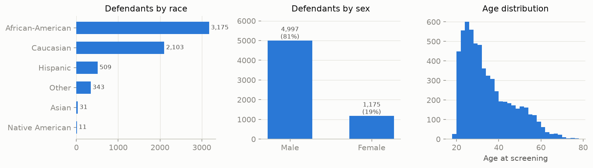
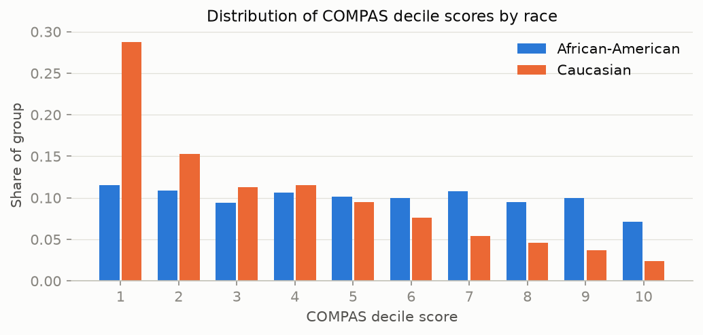
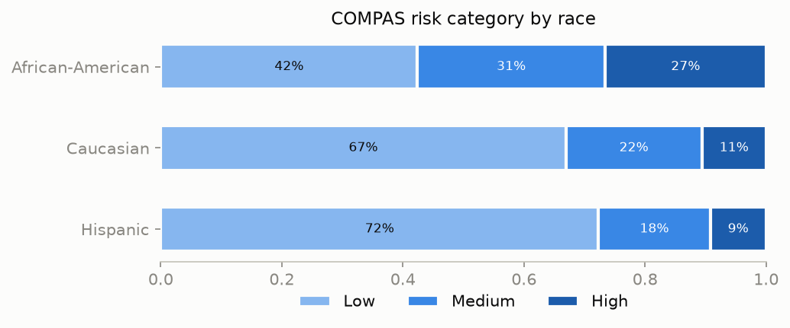
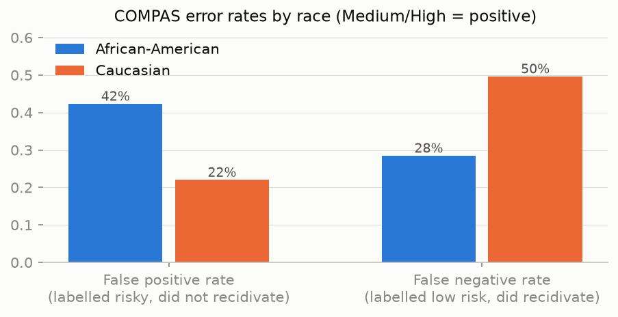

# Exploratory analysis of the COMPAS dataset

Dataset: `compas-scores-two-years.csv` from ProPublica's
[compas-analysis](https://github.com/propublica/compas-analysis) repository.
Raw file: **7,214 defendants, 53 variables**. After applying
ProPublica's cohort filter (screening within ±30 days of arrest, valid COMPAS
record, no ordinary traffic offenses, non-missing score):
**6,172 defendants**.

## RQ1 — Is the dataset representative and what does it represent?

**What it represents.** Every row is a *criminal defendant* screened with the
COMPAS risk-assessment tool in **Broward County, Florida, in 2013–2014**, joined
with their criminal history and a two-year follow-up flag (`two_year_recid`)
indicating whether the person was **re-arrested** within two years. Key variable
groups:

- demographics: `sex`, `age`, `age_cat`, `race`
- criminal history: `priors_count`, `juv_fel_count`, `juv_misd_count`, `juv_other_count`
- current case: `c_charge_degree` (felony/misdemeanor), `c_charge_desc`
- COMPAS outputs: `decile_score` (1–10), `score_text` (Low/Medium/High)
- outcome: `is_recid`, `two_year_recid`

**What it does not represent.** The outcome label is *re-arrest*, not
*re-offense*: crimes that never lead to an arrest are invisible, and arrest
intensity varies across neighborhoods and demographic groups. The data covers a
single county, a single two-year window, and only people who were arrested and
screened — it is **not representative of crime**, of the US, or even of Broward
County's general population. For comparison, African-Americans were roughly
28% of Broward County's population in 2013 but are
**51% of the defendants** in this dataset.

**Why it is used in AI-fairness research.** ProPublica's 2016 investigation
("Machine Bias", Angwin et al.) made it the canonical public benchmark: it
contains a deployed algorithm's actual scores, ground-truth follow-up, and
sensitive attributes, which is a rare combination that allows fairness metrics
to be computed openly.

## RQ2 — Does the dataset reflect historical and institutional inequalities?

The dataset is a record of **criminal justice decisions**, not of criminal
behavior. Each step of the funnel that produced a row involves discretionary
human decisions in which documented disparities exist:

1. **Policing bias** — who gets stopped, searched, and arrested. Arrest data
   over-represents heavily policed (disproportionately Black and low-income)
   neighborhoods, and this same mechanism generates the `two_year_recid` label.
2. **Charging and sentencing bias** — `c_charge_degree` and `priors_count`
   reflect prosecutorial and judicial choices, not just conduct.
3. **Socioeconomic inequality** — priors accumulate faster where people cannot
   afford bail, diversion programs, or private counsel; the count then feeds
   back into future risk scores.
4. **Feedback loops** — a high risk score can lead to detention, job loss and
   heavier surveillance, raising the probability of future *arrest* and
   apparently "confirming" the score.

Consequently, a model trained on this data learns the behavior of the Broward
County criminal justice system as much as the behavior of defendants.

## RQ3 — What demographic disparities exist in the dataset?

- **Race:** African-American 3,175
  (51.4%), Caucasian 2,103
  (34.1%), Hispanic 509
  (8.2%); Asian and Native American together are under 1%.
- **Sex:** 81.0% male, 19.0% female.
- **Age:** strongly right-skewed; median 31 years, with the
  bulk of defendants between 25 and 45.

### Risk score distribution

Caucasian defendants' decile scores pile up at the low end (mean decile
3.6), while African-American defendants' scores are
close to uniform across deciles (mean 5.3).
58% of
African-American defendants are rated Medium or High risk versus
33% of Caucasian
defendants. Observed two-year re-arrest rates differ too
(52% vs 39%),
but — as RQ2 argues — the label itself is generated by the same unequally
distributed enforcement.

### Error rates: the core ProPublica finding

Treating Medium/High as a positive prediction of recidivism:

| Group | False positive rate | False negative rate |
|-------|--------------------:|--------------------:|
| African-American | **42.3%** | 28.5% |
| Caucasian | 22.0% | **49.6%** |

African-American defendants who did **not** recidivate were flagged as risky
about **1.9× as often** as Caucasian defendants; Caucasian
defendants who **did** recidivate were mislabelled low-risk about
1.7× as often. The errors are asymmetric in direction: they
harm Black defendants (excess detention) and favor white defendants (excess
leniency). This asymmetry is the benchmark that the rest of the project tries
to detect, explain, and mitigate.
