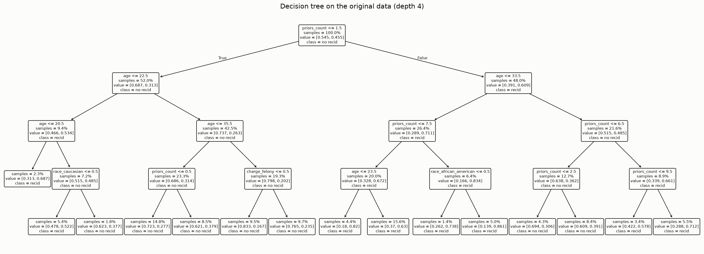
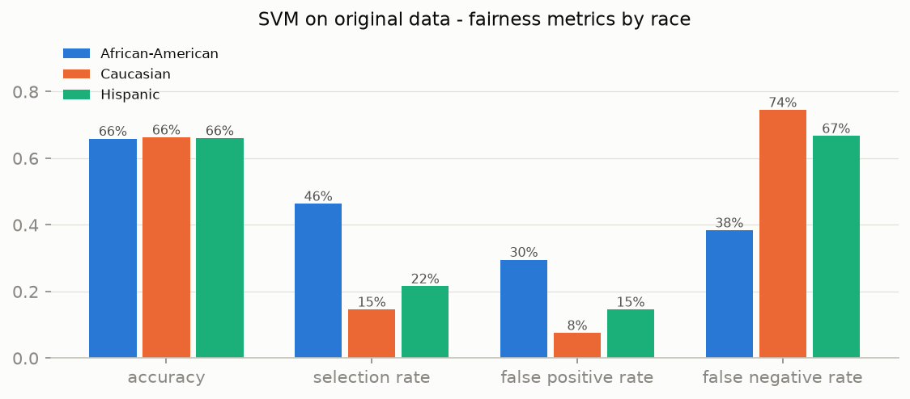

# Baseline models on the original data

Split: 70/30 train/test, stratified jointly on outcome and race
(4,320 train / 1,852 test). Features: age, priors count,
juvenile counts (felony/misdemeanor/other), charge degree, sex, **and race**
(one-hot).

**On including race.** Deliberately keeping race in this baseline is itself an
ethical decision that requires justification: the point of the reference model
is to *expose* how much predictive weight the data assigns to race, so that the
de-biasing step has a measurable target. A deployed system should not use race
as an input - but silently dropping it does not produce fairness either
("fairness through unawareness"), because priors count, charge degree and age
act as proxies. This is exactly what the de-biasing step (script 04) addresses.

## Interpretable decision tree

Accuracy **66.3%**, ROC-AUC **0.709**.




The learned rules are dominated by `priors_count` and `age`:

```text
|--- priors_count <= 1.5
|   |--- age <= 22.5
|   |   |--- age <= 20.5
|   |   |   |--- class: 1
|   |   |--- age >  20.5
|   |   |   |--- race_caucasian <= 0.5
|   |   |   |   |--- class: 1
|   |   |   |--- race_caucasian >  0.5
|   |   |   |   |--- class: 0
|   |--- age >  22.5
|   |   |--- age <= 35.5
|   |   |   |--- priors_count <= 0.5
|   |   |   |   |--- class: 0
|   |   |   |--- priors_count >  0.5
|   |   |   |   |--- class: 0
|   |   |--- age >  35.5
|   |   |   |--- charge_felony <= 0.5
|   |   |   |   |--- class: 0
|   |   |   |--- charge_felony >  0.5
|   |   |   |   |--- class: 0
|--- priors_count >  1.5
|   |--- age <= 33.5
|   |   |--- priors_count <= 7.5
|   |   |   |--- age <= 23.5
|   |   |   |   |--- class: 1
|   |   |   |--- age >  23.5
|   |   |   |   |--- class: 1
|   |   |--- priors_count >  7.5
|   |   |   |--- race_african_american <= 0.5
|   |   |   |   |--- class: 1
|   |   |   |--- race_african_american >  0.5
|   |   |   |   |--- class: 1
|   |--- age >  33.5
|   |   |--- priors_count <= 6.5
|   |   |   |--- priors_count <= 2.5
|   |   |   |   |--- class: 0
|   |   |   |--- priors_count >  2.5
|   |   |   |   |--- class: 0
|   |   |--- priors_count >  6.5
|   |   |   |--- priors_count <= 9.5
|   |   |   |   |--- class: 1
|   |   |   |--- priors_count >  9.5
|   |   |   |   |--- class: 1
```

Two observations relevant to the ethics assessment:

1. The tree achieves essentially the same accuracy as COMPAS itself (~65%),
   echoing Dressel & Farid (2018): a transparent model with a handful of
   features matches the proprietary 137-question instrument. There is no
   accuracy argument for opacity.
2. Race dummies barely appear in the split rules, yet the fairness audit below
   still shows large error-rate gaps - the bias travels through `priors_count`
   and `age`, which are products of unequal policing intensity (see RQ2).

## Reference SVM ("biased model")

RBF-kernel SVM. Accuracy **66.0%**, ROC-AUC **0.720**.



| Metric | African-American | Caucasian | Hispanic |
|--------|----------------:|----------:|---------:|
| Accuracy | 65.9% | 66.2% | 66.0% |
| Selection rate | 46.3% | 14.6% | 21.6% |
| False positive rate | 29.5% | 7.6% | 14.6% |
| False negative rate | 38.4% | 74.5% | 66.7% |

Decision tree for comparison (same test set): FPR
41.6% vs
16.4%, FNR
28.5% vs
59.1%
(African-American vs Caucasian).

Aggregate disparity of the SVM restricted to African-American vs Caucasian:

- **Demographic parity difference: 0.317** (gap in the share of people
  flagged as likely recidivists)
- **Equalized odds difference: 0.361** (largest gap in FPR or TPR)

The model reproduces the asymmetry found in the COMPAS scores themselves
(report 02): African-American defendants face a much higher false positive
rate, Caucasian defendants a much higher false negative rate. Training a fresh
model on the raw data *reproduces* the injustice pattern of the data-generating
system - the reference point the de-biasing step must improve on.

## ALTAI Requirement #2 - accuracy in context

An accuracy of ~66% means roughly one in three suggestions is wrong.
For a system that could influence detention decisions this error rate is only
acceptable - if at all - in a decision-support setting with a human weighing
independent evidence (see reports/07_reflection.md).
