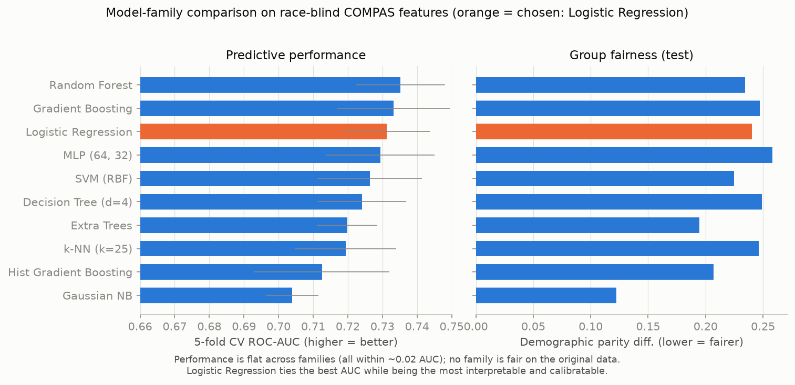

# Model selection: which classifier for COMPAS?

Before committing to a model, every practical classifier family is benchmarked
under the regime the system actually deploys in (**race-blind**: the 7 non-race
features). Accuracy and ROC-AUC come from **5-fold stratified cross-validation**
on the training split; fairness is measured on the held-out test split
(African-American vs Caucasian). The 70/30 split created here (stratified
jointly on outcome and race, 4,320 train / 1,852 test) is
persisted and reused by every later script.

| Model | CV acc | CV AUC | Test acc | Test AUC | DPD | EOD | FPR gap |
|-------|-------:|-------:|---------:|---------:|----:|----:|--------:|
| Random Forest | 0.689 | 0.735 | 0.660 | 0.719 | 0.234 | 0.215 | +0.184 |
| Gradient Boosting | 0.688 | 0.733 | 0.665 | 0.725 | 0.247 | 0.231 | +0.192 |
| Logistic Regression | 0.681 | 0.731 | 0.670 | 0.724 | 0.240 | 0.248 | +0.164 |
| MLP (64, 32) | 0.681 | 0.729 | 0.670 | 0.720 | 0.258 | 0.239 | +0.204 |
| SVM (RBF) | 0.676 | 0.726 | 0.657 | 0.719 | 0.225 | 0.236 | +0.152 |
| Decision Tree (d=4) | 0.685 | 0.724 | 0.659 | 0.708 | 0.249 | 0.234 | +0.196 |
| Extra Trees | 0.662 | 0.720 | 0.652 | 0.714 | 0.195 | 0.203 | +0.130 |
| k-NN (k=25) | 0.677 | 0.719 | 0.667 | 0.717 | 0.246 | 0.232 | +0.189 |
| Hist Gradient Boosting | 0.672 | 0.713 | 0.657 | 0.712 | 0.207 | 0.187 | +0.159 |
| Gaussian NB | 0.627 | 0.704 | 0.607 | 0.704 | 0.122 | 0.149 | +0.066 |
| Majority baseline | 0.545 | 0.500 | 0.545 | 0.500 | 0.000 | 0.000 | +0.000 |

## Finding 1 - the performance ceiling is flat

Every genuine model lands in a CV ROC-AUC band of just **0.704 -
0.735** (spread 0.031) and ~66-67% accuracy. The
best family (Random Forest, AUC 0.735) beats Logistic Regression
(0.731) by ~0.004 AUC - inside the
cross-validation noise (±0.012). This is a direct, quantitative
confirmation of Dressel & Farid (2018): on this data a handful of features caps
predictive power, and model complexity buys essentially nothing. **There is no
accuracy argument for an opaque model here.**

## Finding 2 - fairness is not a model-selection lever

No family is fair on the original data: demographic-parity differences run
0.12-0.26 and FPR gaps
+0.07 to +0.20. The models that look
"fairer" (e.g. Gaussian NB) get there only by predicting fewer positives, at an
accuracy cost. Unfairness lives in the labels and base rates, not in the choice
of estimator - which is why the project addresses it at the data level
(script 05) rather than by shopping for a model.

## Decision: Logistic Regression

Because performance is tied across the board, the choice is made on the axes
that actually differ:

1. **Performance** - LR matches the top ensembles on test AUC
   (0.724) and accuracy (67.0%); the gap to the best
   family is within noise.
2. **Interpretability** - a linear model exposes a signed weight per feature,
   so the reference "biased" model can be read directly (script 04), reinforcing
   the project's thesis that opacity is unnecessary.
3. **Calibration & stability** - logistic outputs are well-calibrated
   probabilities (the demo presents a *probability*, not a label) and LR has no
   high-variance hyperparameters to overfit on a small dataset.
4. **Compatibility with the de-biasing step** - Fairlearn's `CorrelationRemover`
   is a *linear* transform; pairing it with a linear model makes the
   de-biasing near-exact. Script 06 shows LR on the de-biased data reaching
   demographic parity an SVM or tree ensemble cannot (DPD ~0.03 race-aware).

The RBF-SVM used as the project's earlier reference is mid-pack here
(AUC 0.726) and opaque; it is
retained in the table above only as a benchmarked alternative. **All downstream
scripts (04-07) and the demo now use Logistic Regression.** The depth-4 decision
tree is kept in script 04 as an inherently-transparent sanity reference, not as
the deployed model.
