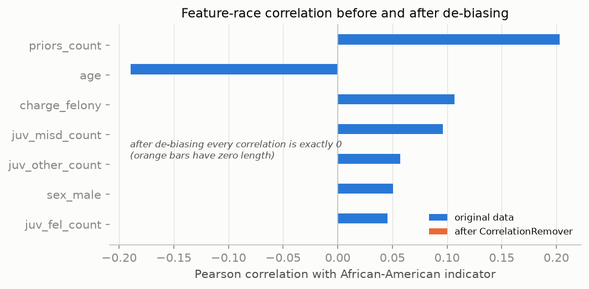

# Automated bias detection and data-level de-biasing

## Detection 1 - which features carry race information?

Pearson correlation of each candidate feature with the African-American
indicator (training split):

| Feature | Correlation (original) | Correlation (de-biased) |
|---------|----------------------:|------------------------:|
| `priors_count` | +0.203 | -0.000 |
| `age` | -0.189 | +0.000 |
| `charge_felony` | +0.107 | -0.000 |
| `juv_misd_count` | +0.096 | -0.000 |
| `juv_other_count` | +0.057 | -0.000 |
| `sex_male` | +0.051 | -0.000 |
| `juv_fel_count` | +0.045 | -0.000 |

`priors_count`, `age` and the juvenile counts all correlate with race - they
are exactly the features the baseline models lean on (report 04). This is the
quantitative footprint of the institutional bias discussed in RQ2: unequal
policing shows up as unequal *measured* criminal history.

## Detection 2 - the proxy test

A logistic regression trying to predict whether a defendant is
African-American from the seven non-race features reaches
**AUC 0.682** on the held-out test split - far from random (0.5).
Simply deleting the race column therefore does **not** remove race from the
data; the model can partially reconstruct it. This is the classic failure of
*fairness through unawareness*.

## Mitigation - what was changed and why

1. **Race dummies removed** from the feature set. Using a protected attribute
   as a direct input to a punitive risk model is not compatible with ALTAI
   Requirement #5 (avoidance of unfair bias) or with equal-protection norms.
2. **Fairlearn `CorrelationRemover` (alpha=1.0)** applied to the remaining
   features: each feature is linearly transformed so its correlation with the
   African-American indicator becomes zero, while retaining as much of the
   original information as possible.

After the transformation the same proxy test drops to
**AUC 0.508** (~random), and every feature-race correlation is
~0 (figure below). Race - direct or by linear proxy - is no longer encoded in
the training data.

## What this does *not* fix (honest limitations)

- **Label bias.** The target `two_year_recid` means *re-arrest*. Base rates in
  the training data differ (52%
  African-American vs 39% Caucasian), and part of
  that gap is produced by unequal enforcement, which no feature transformation
  can undo. De-biasing the features removes the model's ability to treat
  equally-situated people differently by race; it cannot correct who got
  arrested in the first place.
- **Non-linear proxies.** CorrelationRemover removes *linear* dependence. The
  near-random proxy AUC after transformation suggests little non-linear signal
  remains here, but this must be re-checked whenever features are added.
- **The impossibility theorem still applies.** With different base rates,
  calibration and equal error rates cannot hold simultaneously
  (Chouldechova 2017); script 06 measures where the de-biased model lands.

## Note on the dropped AutoML step

The original proposal included an AutoML tool to pinpoint what needs
de-biasing. That step was descoped; the automated detection above (correlation
scan + proxy predictability test + the Fairlearn audit of report 04) fulfils
the same role with transparent, reproducible methods.
