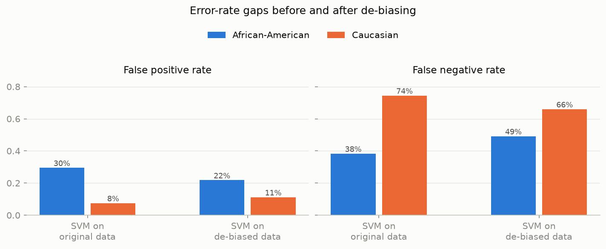

# SVM on the de-biased data

Identical architecture to the reference model (StandardScaler + RBF SVM,
C=1.0), trained on the de-biased features from script 04. Race enters the
pipeline only as an **audit attribute**.

## Performance

| Model | Accuracy | ROC-AUC |
|-------|---------:|--------:|
| SVM, original data | 66.0% | 0.720 |
| SVM, de-biased data | **65.3%** | **0.714** |

De-biasing costs +0.6% accuracy - essentially within noise. The
"fairness tax" on predictive performance is negligible here, consistent with
the finding that most of the usable signal (priors, age) is retained after the
transformation.

## Fairness comparison (African-American vs Caucasian, test set)

| Metric | SVM original | SVM de-biased |
|--------|-------------:|--------------:|
| FPR African-American | 29.5% | 21.8% |
| FPR Caucasian | 7.6% | 11.2% |
| **FPR gap** | **22.0%** | **10.6%** |
| FNR African-American | 38.4% | 49.2% |
| FNR Caucasian | 74.5% | 66.0% |
| **FNR gap** | **36.1%** | **16.8%** |
| Demographic parity difference | 0.317 | **0.168** |
| Equalized odds difference | 0.361 | **0.168** |

Full per-group metrics of the de-biased model:

| Metric | African-American | Caucasian | Hispanic |
|--------|----------------:|----------:|---------:|
| Accuracy | 63.9% | 67.4% | 66.0% |
| Selection rate | 37.0% | 20.1% | 28.1% |
| False positive rate | 21.8% | 11.2% | 19.8% |
| False negative rate | 49.2% | 66.0% | 57.9% |

## Reading the result honestly

The error-rate gaps shrink substantially but do **not** vanish. The remaining
gap is driven by the different *base rates* of the re-arrest label - the part
of the disparity that lives in the outcome variable itself and that no
feature-side intervention can remove (Chouldechova 2017). Closing it entirely
would require either post-processing per-group thresholds (a policy decision
with its own ethical cost: explicit differential treatment) or better labels
(measuring reoffending rather than re-arrest).

This residual gap is a further argument for the project's central claim: the
system must remain a **suggestion** presented to accountable humans, together
with its known error profile - not an automated decision.
