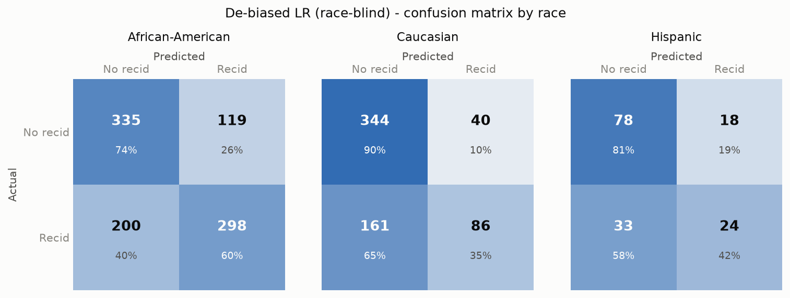

# Logistic Regression on the de-biased data

Identical architecture to the reference model (StandardScaler + Logistic
Regression), trained on the de-biased features from script 05. Race enters the
pipeline only as an **audit attribute**.

## Deployment decision: race-blind inference

The CorrelationRemover needs the sensitive attribute to transform a row, which
poses a choice for prediction time:

| Deployment | Accuracy | Demographic parity diff. | Equalized odds diff. | Individual race-invariance |
|------------|---------:|-------------------------:|---------------------:|:--:|
| **Race-blind** (raw features at inference, chosen) | 67.1% | 0.238 | 0.250 | yes - exact |
| Race-aware (transform with the person's race) | 65.0% | 0.028 | 0.075 | no |

The race-aware variant achieves markedly better *group* fairness - with a
linear model on top of the linear CorrelationRemover the demographic-parity
difference falls to **0.028** (near-parity), the pairing script 03
anticipated. But a person's stated race then moves their individual score: it
breaks counterfactual fairness, requires collecting the protected attribute at
decision time, and amounts to explicit differential treatment. We therefore
deploy **race-blind**: the de-biasing is a training-time intervention (the
model's *coefficients* were learned from race-neutralized data), and at
prediction time the model never sees race, so flipping race provably cannot
change any suggestion. All numbers below use race-blind inference.

## Performance

| Model | Accuracy | ROC-AUC |
|-------|---------:|--------:|
| LR, original data | 67.2% | 0.724 |
| LR, de-biased data | **67.1%** | **0.724** |

De-biasing costs +0.2% accuracy - essentially within noise. The
"fairness tax" on predictive performance is negligible here, consistent with
the finding that most of the usable signal (priors, age) is retained after the
transformation.

The overall error profile barely moves from the biased reference - de-biasing
rebalances *who* the errors fall on across racial groups rather than changing
the aggregate count, which is the intended effect. The confusion matrix by race
under race-blind inference (cells shaded by row share, so the diagonal reads as
per-class accuracy) makes that rebalancing visible: compared with the biased
model's per-race matrix (report 04), the false-positive cell for
African-American defendants lightens (32% -> 26%) while their false-negative
cell darkens (34% -> 40%). Their error profile shifts toward the Caucasian
panel - which barely moves - narrowing, though not closing, the gap:

## Fairness comparison (African-American vs Caucasian, test set)

| Metric | LR original | LR de-biased |
|--------|------------:|-------------:|
| FPR African-American | 32.2% | 26.2% |
| FPR Caucasian | 10.4% | 10.4% |
| **FPR gap** | **21.7%** | **15.8%** |
| FNR African-American | 34.1% | 40.2% |
| FNR Caucasian | 65.6% | 65.2% |
| **FNR gap** | **31.5%** | **25.0%** |
| Demographic parity difference | 0.300 | **0.238** |
| Equalized odds difference | 0.315 | **0.250** |

Full per-group metrics of the de-biased model:

| Metric | African-American | Caucasian | Hispanic |
|--------|----------------:|----------:|---------:|
| Accuracy | 66.5% | 68.1% | 66.7% |
| Selection rate | 43.8% | 20.0% | 27.5% |
| False positive rate | 26.2% | 10.4% | 18.8% |
| False negative rate | 40.2% | 65.2% | 57.9% |

## Reading the result honestly

Under race-blind inference the error-rate gaps shrink but do **not** vanish.
Two forces bound how far a feature-side intervention can go: (1) the different
*base rates* of the re-arrest label - the part of the disparity that lives in
the outcome variable itself (Chouldechova 2017); and (2) the deliberate choice
of race-blind inference, which trades the near-parity of the race-aware variant
(DPD 0.028) for an exact individual-level guarantee. Closing the
residual gap entirely would require either post-processing per-group thresholds
(explicit differential treatment) or better labels (measuring reoffending
rather than re-arrest).

This residual gap is a further argument for the project's central claim: the
system must remain a **suggestion** presented to accountable humans, together
with its known error profile - not an automated decision.
