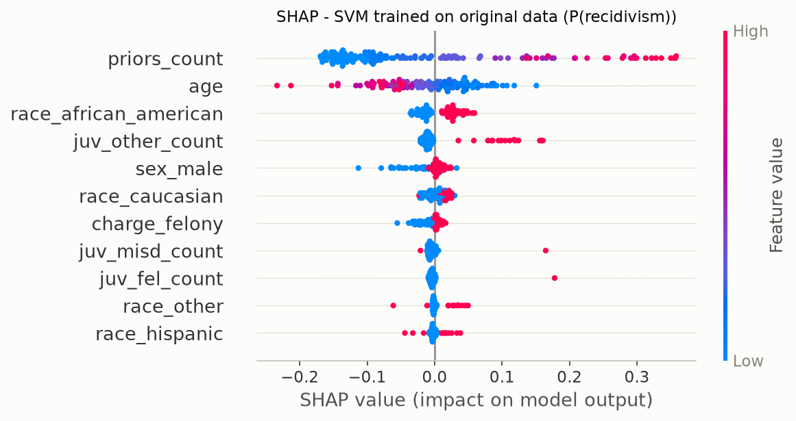
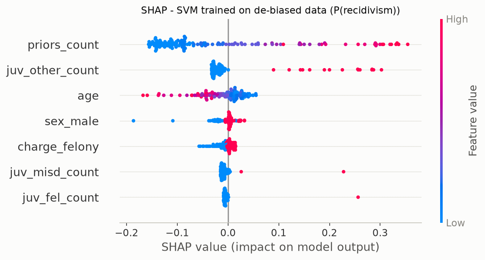
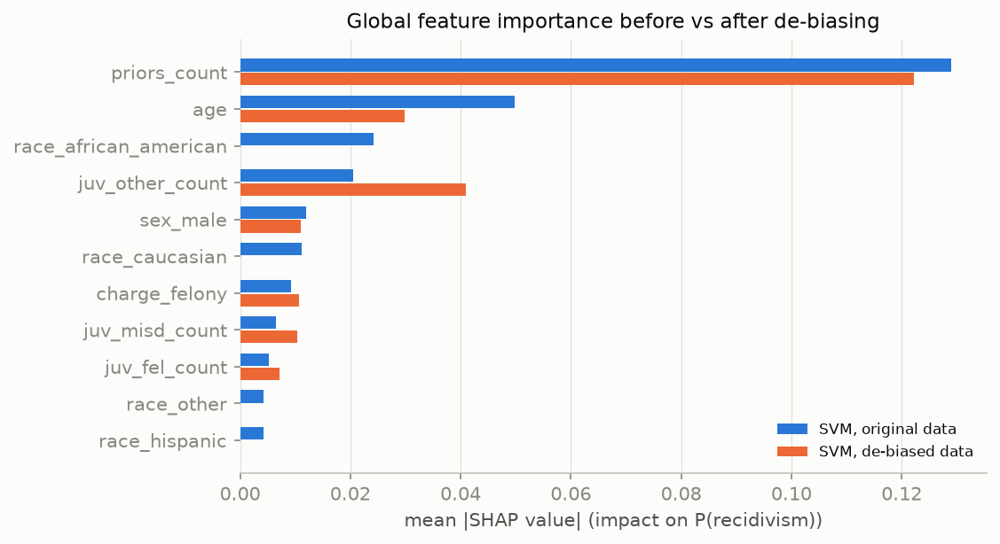
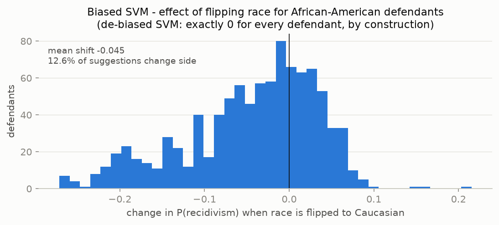

# Explainability comparison: biased vs de-biased model

SHAP values computed with the permutation explainer on 150 sampled test
defendants (30 background samples, seed 42), explaining each
model's predicted probability of recidivism.

## What drives each model







Both models rely primarily on `priors_count` and `age`. In the model trained
on original data the race dummies contribute
**15.9% of the total attribution mass** - direct evidence that
the model uses race itself, on top of whatever flows through proxies. In the
de-biased model this contribution is structurally zero (race is not an input),
and the remaining features were decorrelated from race, so their attributions
no longer secretly encode it (proxy AUC ~0.51, report 04).

Note how the de-biased model's attributions are not merely the biased model's
minus race: the importance of `priors_count` changes as well, because the
CorrelationRemover shifted each defendant's priors relative to their group
mean. The model still uses criminal history - it just can no longer use the
*racial component* of criminal history.

## Counterfactual race-flip

Changing **only** the race field and re-scoring every test defendant:

| Counterfactual | n | Biased SVM: mean shift in P(recid) | Biased SVM: suggestions that change side | De-biased SVM |
|---------------|---:|----------------------------------:|-----------------------------------------:|--------------:|
| African-American -> Caucasian | 952 | -0.045 | 12.6% | 0 (exact) |
| Caucasian -> African-American | 631 | +0.025 | 8.9% | 0 (exact) |



For the biased model, relabelling an African-American defendant as Caucasian
lowers the estimated recidivism probability for most individuals and flips
roughly **one suggestion in eight** - people would receive a different risk
label for no reason other than race. The de-biased model is race-blind at
inference, so the same experiment cannot change any suggestion - not as an
empirical observation but **by construction**, which is the stronger guarantee
(ALTAI Requirement #5).

## DiCE - "what would have to change?"

For one defendant the de-biased model rates high-risk
(age 28, 3 priors, felony charge:
yes), DiCE searches for minimal feature
changes that would flip the suggestion to low-risk (binary columns are
treated as continuous by the sampler, so values like 0.1 read as
"switched off"):

```text
 age  priors_count  juv_fel_count  juv_misd_count  juv_other_count  charge_felony  sex_male  two_year_recid
28.0           3.0            0.0             0.0              1.0            0.1       0.1               0
28.0           3.0            0.0             0.0              0.1            0.0       1.0               0
28.0           3.0            0.0             0.5              0.3            1.0       1.0               0
```

The counterfactuals identify small changes - dropping the felony charge
degree or the juvenile record - that would move this person across the
decision boundary. Counterfactuals like these are what a human
decision-maker should see next to every score: they expose *why* the
suggestion is what it is and how close the person is to the boundary
(see the Streamlit demo).

