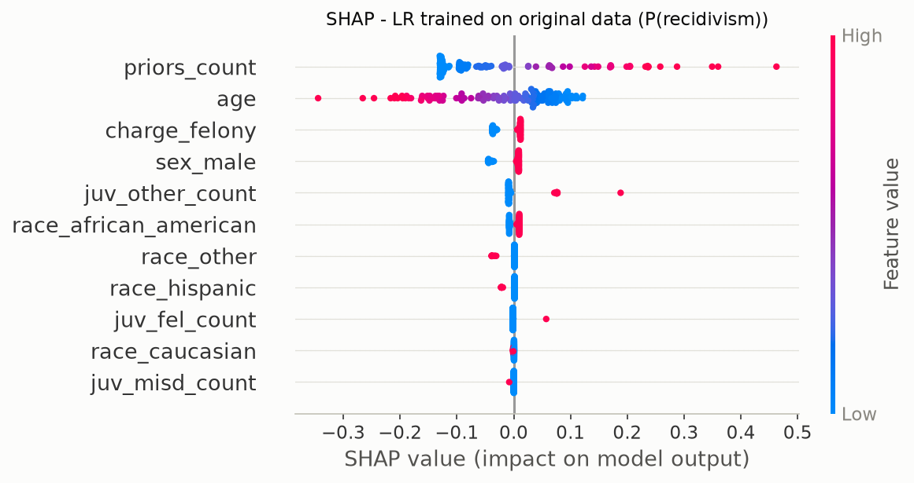
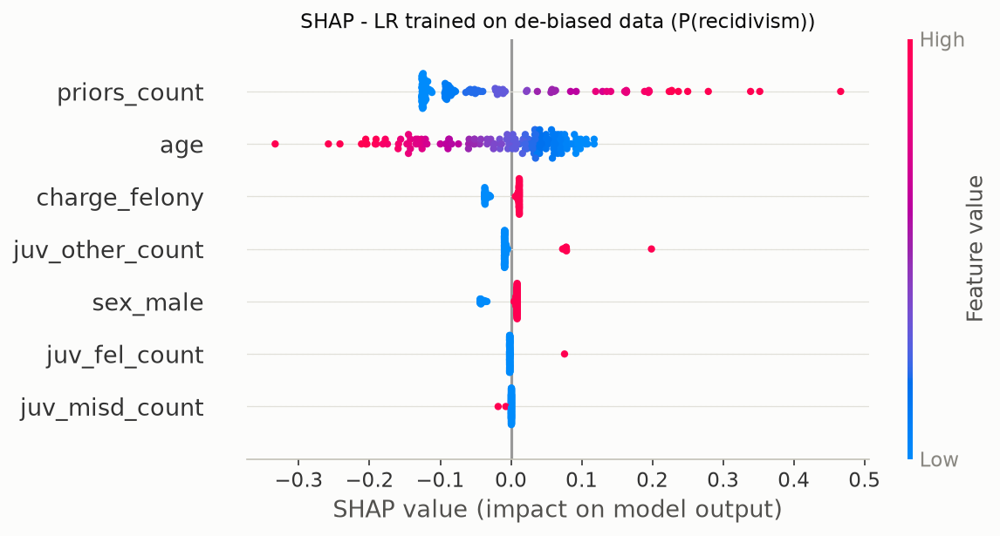
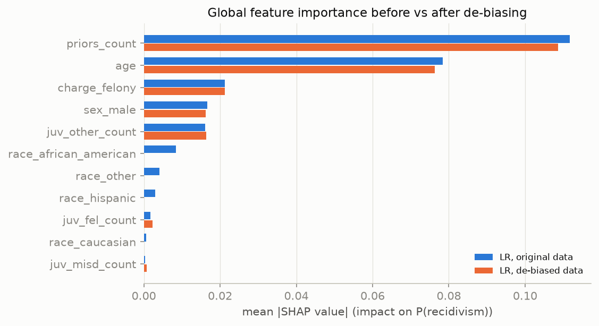
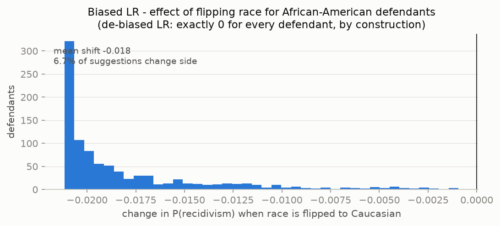

# Explainability comparison: biased vs de-biased model

SHAP values computed with the permutation explainer on 150 sampled test
defendants (30 background samples, seed 42), explaining each
model's predicted probability of recidivism. Both models are Logistic
Regressions (selected in report 03).

## What drives each model







Both models rely primarily on `priors_count` and `age`. In the model trained
on original data the race dummies contribute
**6.1% of the total attribution mass** - direct evidence that
the model uses race itself, on top of whatever flows through proxies. In the
de-biased model this contribution is structurally zero (race is not an input),
and the remaining features were decorrelated from race, so their attributions
no longer secretly encode it (proxy AUC ~0.51, report 05).

Note how the de-biased model's attributions are not merely the biased model's
minus race: the importance of `priors_count` changes as well, because the
CorrelationRemover shifted each defendant's priors relative to their group
mean. The model still uses criminal history - it just can no longer use the
*racial component* of criminal history.

## Counterfactual race-flip

Changing **only** the race field and re-scoring every test defendant:

| Counterfactual | n | Biased LR: mean shift in P(recid) | Biased LR: suggestions that change side | De-biased LR |
|---------------|---:|----------------------------------:|-----------------------------------------:|--------------:|
| African-American -> Caucasian | 952 | -0.018 | 6.7% | 0 (exact) |
| Caucasian -> African-American | 631 | +0.018 | 4.1% | 0 (exact) |



For the biased model, relabelling an African-American defendant as Caucasian
lowers the estimated recidivism probability for most individuals and flips a
share of suggestions - people would receive a different risk label for no
reason other than race. The de-biased model is race-blind at inference, so the
same experiment cannot change any suggestion - not as an empirical observation
but **by construction**, which is the stronger guarantee (ALTAI Requirement #5).

## DiCE - "what would have to change?"

The de-biased model rates one defendant high-risk (age 30,
11 prior offenses, felony charge:
no). Holding the immutable attributes (age,
sex) fixed, DiCE searches the criminal-history features for minimal changes
that would flip the suggestion to low-risk (binary columns are treated as
continuous by the sampler, so fractional values read as "partly switched
off"):

```text
 age  priors_count  juv_fel_count  juv_misd_count  juv_other_count  charge_felony  sex_male  two_year_recid
30.0           0.2            0.0             0.0              0.1            0.0       1.0               0
30.0           1.0            0.0             0.0              0.2            0.0       1.0               0
30.0           2.1            0.0             0.0              0.5            0.0       1.0               0
```

The dominant lever is `priors_count`: with a prior record this heavy, the model
only crosses to a low-risk suggestion once the prior count is sharply reduced.
That is exactly the kind of explanation a human decision-maker should see next
to every score - it exposes *why* the suggestion is what it is and how far the
person sits from the boundary - while also exposing an honest limit of
counterfactuals: not every high-risk profile has a small or realistic path to
low-risk (see the Streamlit demo).

